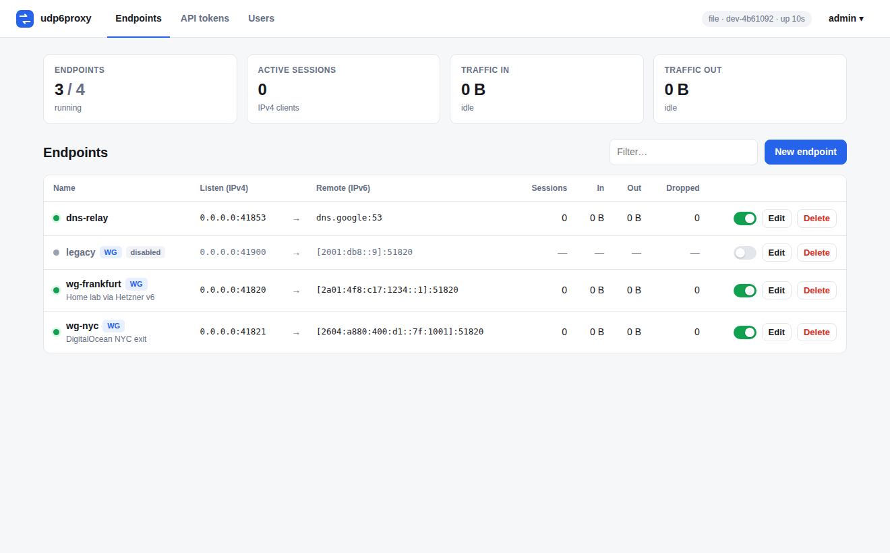

# udp6proxy

Relay UDP traffic from IPv4 clients to IPv6-only hosts. It was built so that
WireGuard clients on IPv4-only networks can reach peers that only have an
IPv6 endpoint.

```
 IPv4 client ──udp4──▶ udp6proxy (dual-stack host) ──udp6──▶ IPv6-only peer
  (WireGuard)          0.0.0.0:12345                       [2001:db8::1]:51820
```

It ships as a single dependency-free binary with:

- **The proxy**: per-client sessions, optional WireGuard-only filtering, and live reconfiguration without dropping unchanged endpoints.
- **A web UI** to add, edit, enable/disable and delete endpoints, and to watch live traffic, sessions and drops.
- **A REST API** with login sessions and API tokens, plus Prometheus `/metrics`.
- **A CLI** (`udp6proxy endpoint add …`) that talks to the API, locally or remotely.
- **Storage**: a local JSON file by default, or Redis to share endpoints between several proxy nodes.



## Quick start

```bash
git clone https://github.com/m-motawea/udp6proxy && cd udp6proxy
make build                       # needs Go ≥ 1.22; produces ./udp6proxy
./udp6proxy serve -c config.toml
```

On first start the daemon creates the user `admin` and prints a random
password. You can also set `UDP6PROXY_ADMIN_PASSWORD` before the first start.
Then open <http://127.0.0.1:8080/>.

The host running udp6proxy needs both IPv4 and IPv6 connectivity. To bind
ports below 1024 without root: `sudo setcap cap_net_bind_service=+ep udp6proxy`.

### As a service

```bash
sudo install -m755 udp6proxy /usr/local/bin/
sudo mkdir -p /etc/udp6proxy && sudo cp config.toml /etc/udp6proxy/
# in /etc/udp6proxy/config.toml set: [Storage] StateDir = "/var/lib/udp6proxy"
sudo cp contrib/udp6proxy.service /etc/systemd/system/
sudo systemctl daemon-reload && sudo systemctl enable --now udp6proxy
journalctl -u udp6proxy | grep password      # initial admin password
```

`systemctl reload udp6proxy` (SIGHUP) re-reads endpoints from storage right away.

## CLI

The same binary is the client. `login` stores a server URL and API token in
`~/.config/udp6proxy/cli.json` (on macOS: `~/Library/Application Support/udp6proxy/cli.json`).

```bash
udp6proxy login --server http://127.0.0.1:8080          # prompts for user/password, creates a token
udp6proxy login --server https://proxy.example --token u6p_…   # or use an existing token

udp6proxy endpoint ls
udp6proxy endpoint add wg-fra --port 41820 --remote "[2a01:4f8::1]:51820" --desc "Frankfurt"
udp6proxy endpoint set wg-fra --idle 300 --wireguard=false
udp6proxy endpoint disable wg-fra
udp6proxy endpoint sessions wg-fra
udp6proxy endpoint rm wg-fra -y
udp6proxy status

udp6proxy token create ci --ttl-days 90      # prints the token once
udp6proxy user add alice                     # prompts for password
udp6proxy -o json endpoint ls                # machine-readable output
```

You can also set `UDP6PROXY_SERVER` and `UDP6PROXY_TOKEN` instead of running `login`.

If nobody can log in, reset a password offline on the server with
`udp6proxy passwd -c /etc/udp6proxy/config.toml admin`, then restart the daemon.

## Configuration

See [`config.toml`](config.toml) for every option. In short:

| Section | Key | Default | Meaning |
|---|---|---|---|
| (top) | `LogLevel` | `info` | `debug` logs every session open/close |
| `[Server]` | `Listen` | `127.0.0.1:8080` | UI/API address; `""` disables it |
| | `TLSCert`, `TLSKey` | | serve HTTPS directly |
| `[Storage]` | `Backend` | `file` | `file` or `redis` |
| | `StateDir` | config dir | holds `endpoints.json` and `auth.json` |
| | `ReloadInterval` | `10` | seconds between storage polls |
| `[Redis]` | `Address`, `Port`, `Username`, `Password`, `DB`, `Prefix`, `TLS` | | Redis connection |
| `[[Endpoint]]` | `Name`, `LocalPort`, `RemoteAddress`, `RemotePort` | | required |
| | `ListenAddress` | `0.0.0.0` | IPv4 address to bind |
| | `WireGuard` | `false` | drop anything that isn't a well-formed WireGuard message |
| | `IdleTimeout` | `180` | seconds before an idle client session is closed |
| | `Description`, `Disabled` | | |

Endpoints in the config file are **seeds**: they are created on startup if
they don't exist yet. After that, the UI, CLI and API own them, so a restart
never overwrites changes made there.

### Security notes

- The UI/API listens on loopback by default. If you expose it, enable TLS
  (`TLSCert`/`TLSKey`) or put it behind a TLS reverse proxy and set
  `SecureCookies = true`. Otherwise passwords and tokens cross the network in clear text.
- Passwords are stored as PBKDF2-SHA256 hashes (600k iterations). For API
  tokens only a SHA-256 digest is kept, and `auth.json` is mode 0600.
- Browser sessions use `HttpOnly` + `SameSite=Strict` cookies, and every
  state-changing request must carry an `X-Requested-With` header, which
  blocks CSRF. After 5 failed logins an IP is locked out for 15 minutes.

## API

Every route except `/healthz` and `/api/v1/auth/login` requires either
`Authorization: Bearer <token>` or a session cookie.

| Method | Path | |
|---|---|---|
| `POST` | `/api/v1/auth/login` / `logout` | `{"username","password"}` → session cookie |
| `GET` | `/api/v1/status` | version, backend, uptime, store errors |
| `GET`/`POST` | `/api/v1/endpoints` | list (with live status and stats) / create |
| `GET`/`PUT`/`PATCH`/`DELETE` | `/api/v1/endpoints/{name}` | `PUT` replaces, `PATCH` merges; a new `name` renames |
| `GET` | `/api/v1/endpoints/{name}/sessions` | active client sessions |
| `GET`/`POST`/`DELETE` | `/api/v1/tokens[/{id}]` | API tokens |
| `GET`/`POST`/`DELETE` | `/api/v1/users[/{name}]`, `PUT /users/{name}/password` | users |
| `POST` | `/api/v1/me/password` | `{"current","new"}` |
| `GET` | `/metrics` | Prometheus metrics per endpoint |

```bash
curl -H "Authorization: Bearer $TOKEN" -d '{"name":"wg1","localPort":41821,"remoteAddress":"2001:db8::2","remotePort":51820,"wireguard":true}' \
  http://127.0.0.1:8080/api/v1/endpoints
```

## How it works

Each endpoint binds one IPv4 UDP socket. When a new client address shows up,
udp6proxy opens a dedicated IPv6 socket to the remote for that client and
relays in both directions. Replies are always sent back to the client that
owns the socket. A session closes after `IdleTimeout` seconds without
traffic. Hostnames are resolved (AAAA) at start and re-resolved every
minute, and sessions move to the new address when it changes.

With `WireGuard = true` a packet is forwarded only if it is a valid
WireGuard message: type 1–4, zero reserved bytes, and the exact size for
handshake and cookie messages or a 16-byte-aligned size for data.

## Upgrading from v1

- `udp6proxy config.toml` still works (it's treated as `serve -c config.toml`),
  and v1 config files are accepted as-is. A config with a `[Redis]` section
  keeps using Redis unless you set `[Storage] Backend = "file"`.
- **Redis layout changed.** Endpoints moved from one key per endpoint
  (found with the blocking `KEYS` command) to a single hash, `<Prefix>endpoints`.
  On first start, v1 keys are imported into the hash automatically. The old
  keys are left alone; delete them once you're happy.
- Behaviour fixes compared to v1:
  - Several clients can share one endpoint. v1 sent every reply to whichever client spoke last.
  - The WireGuard filter works; v1's filter accepted every packet.
  - A Redis outage no longer stops every listener.
  - Endpoints added in Redis with an empty prefix now start.
  - Editing an endpoint takes effect immediately.
  - Datagrams larger than 1500 bytes are no longer truncated.
  - SIGTERM shuts down cleanly.

## Development

```bash
make test      # go vet + go test -race (Redis tests run if redis-server is installed)
make release   # cross-compile to dist/
```

Layout: `cmd/udp6proxy` (entry point), `internal/proxy` (forwarding engine),
`internal/api` (HTTP API and reconcile loop), `internal/web` (embedded UI),
`internal/cli`, `internal/store` (file and Redis), `internal/auth`,
`internal/redisc` (a minimal RESP client).
